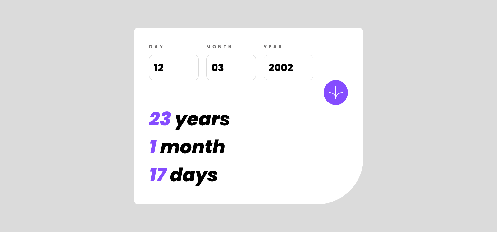

# Frontend Mentor - Age calculator app solution

This is a solution to the [Age calculator app challenge on Frontend Mentor](https://www.frontendmentor.io/challenges/age-calculator-app-dF9DFFpj-Q). Frontend Mentor challenges help you improve your coding skills by building realistic projects. 

## Table of contents

- [Overview](#overview)
  - [The challenge](#the-challenge)
  - [Screenshot](#screenshot)
  - [Links](#links)
- [My process](#my-process)
  - [Built with](#built-with)
  - [What I learned](#what-i-learned)
  - [Continued development](#continued-development)
  - [Useful resources](#useful-resources)
- [Author](#author)

## Overview

### The challenge

Users should be able to:

- View an age in years, months, and days after submitting a valid date through the form
- Receive validation errors if:
  - Any field is empty when the form is submitted
  - The day number is not between 1-31
  - The month number is not between 1-12
  - The year is in the future
  - The date is invalid e.g. 31/04/1991 (there are 30 days in April)
- View the optimal layout for the interface depending on their device's screen size
- See hover and focus states for all interactive elements on the page
- **Bonus**: See the age numbers animate to their final number when the form is submitted

### Screenshot



### Links

- Solution URL: [https://github.com/cisneConCorbata/agecalculatorapp](https://github.com/cisneConCorbata/agecalculatorapp)
- Live Site URL: [https://cisneconcorbata.github.io/agecalculatorapp/](https://cisneconcorbata.github.io/agecalculatorapp/)

## My process

### Built with

- Semantic HTML5 markup
- CSS custom properties
- Flexbox
- CSS Grid

### What I learned

- Using span to improve accesibility

```html
<input type="button" id="submit" class="submit"><span class="sr-only">Submit</span>
```
```css
.sr-only {
    position: absolute;
    width: 1px;
    height: 1px;
    padding: 0;
    margin: -1px;
    overflow: hidden;
    clip: rect(0, 0, 0, 0);
    white-space: nowrap;
    border: 0;
  }
```

- Using aria-labelledby to improve accessibility

```html
<section class="form-container" role="region" aria-labelledby="date-input">
```

- Using the date class to do operations

```js
const current = new Date();
    curDay = current.getDay();
    curMonth = current.getMonth() + 1;
    curYear = current.getFullYear();
```

- Setting intervals
```js
let counter = setInterval(function() {
            i++;
            document.getElementById("results-" + idResults).innerHTML = i;
            if (i == final) {
                clearInterval(counter);
            }
        }, 70);
```

### Continued development

- Practice more with CSS Grid.
- Learn more abut aria.
- Learn about best practices while using conditionals.

### Useful resources

- [ARIA guides](https://developer.mozilla.org/en-US/docs/Web/Accessibility/ARIA/Guides) - For further accessibility read.
- [Date.prototype.getDate()](https://developer.mozilla.org/en-US/docs/Web/JavaScript/Reference/Global_Objects/Date/getDate) - On how to use the date class.

## Author

- GitHub - [cisneConCorbata](https://github.com/cisneConCorbata)
- Frontend Mentor - [@cisneConCorbata](https://www.frontendmentor.io/profile/cisneConCorbata)
